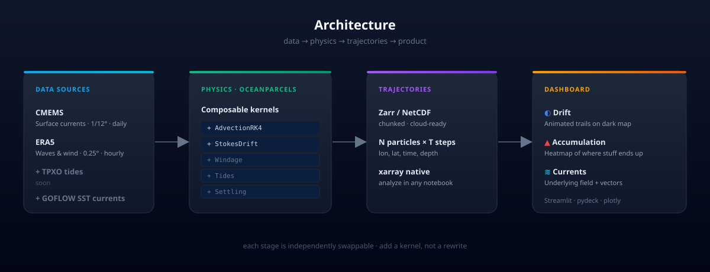
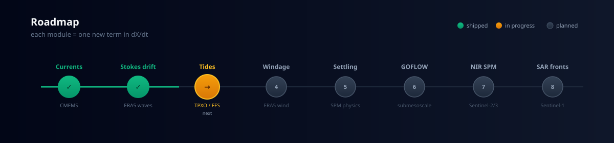

<div align="center">
  
</div>

<p align="center">
  <a href="#"></a>
  <a href="#"></a>
  <a href="https://oceanparcels.org"></a>
  <a href="https://marine.copernicus.eu"></a>
  <a href="#"></a>
</p>

<p align="center">
  <b>Pick a bbox, drop a release point, watch where the ocean takes it.</b><br>
  <sub>A modular Lagrangian transport stack — currents today, waves &amp; tides &amp; submesoscale tomorrow.</sub>
</p>

---

## Why this exists

Most ocean-data products tell you _what the field looks like_ at a grid cell. DriftScope tells you _where the stuff goes_ — sediment from a river plume, plastic from a coastal city, oil from a spill, a search-and-rescue target, larvae from a fishery. That's the question almost everyone outside oceanography actually wants answered.

The whole product is one equation:

$$\frac{d\mathbf{X}}{dt} = \mathbf{u}_{\text{currents}} + \mathbf{u}_{\text{waves}} + \mathbf{u}_{\text{wind}} + \mathbf{u}_{\text{tides}} + \mathbf{w}_{\text{settle}} + \boldsymbol{\eta}$$

Each module on the roadmap is one term on the right-hand side. The particle tracker is the integrator. **Build the spine, bolt on physics.**

---

## Architecture

<div align="center">
  
</div>

Four stages, each independently swappable. Add a new physical process by writing one Parcels kernel and one data fetcher — the rest of the stack doesn't change.

---

## Quickstart

```bash
# 1 · Environment (~2 min)
conda env create -f environment.yml
conda activate driftscope

# 2 · Credentials (free signup at marine.copernicus.eu)
cp .env.example .env
# edit .env — CMEMS user/pass + CDS API key for waves

# 3 · Fetch data for the default region (Sundarbans, last 14 days)
python -m driftscope.fetch
python -m driftscope.fetch_waves    # if module 2 is enabled

# 4 · Run a simulation (500 particles, 10 days)
python -m driftscope.simulate

# 5 · Launch the dashboard
streamlit run app.py
```

Open [http://localhost:8501](http://localhost:8501) — the sidebar has the controls, three tabs for the visuals.

---

## What the dashboard shows

<table>
<tr>
<td width="33%" valign="top">

**◐ &nbsp;Drift**

Animated particle trails on a dark Mapbox basemap. Time slider scrubs through the simulation. Green = release, red = current head, gradient trail = path so far.

</td>
<td width="33%" valign="top">

**▲ &nbsp;Accumulation**

Heatmap of where particles cluster after N days. Toggle between "all positions" (full residence-time field) and "final positions" (where they end up). Adjustable bin resolution.

</td>
<td width="33%" valign="top">

**≋ &nbsp;Currents**

The underlying CMEMS velocity field driving everything. Speed colormap with vector overlay, time-step slider. Sanity-check that what's pushing your particles makes sense.

</td>
</tr>
</table>

---

## Roadmap

<div align="center">
  
</div>

| # | Module | Adds | Data source | Status |
|---|---|---|---|---|
| 1 | **Eulerian advection** | `u_currents` | CMEMS GLOBAL_ANALYSISFORECAST_PHY | ✅ shipped |
| 2 | **Stokes drift** | `u_waves` | ERA5 (Hs, Tp, mwd) | ✅ shipped |
| 3 | **Tides** | `u_tides` | TPXO9-atlas-v5 (via pyTMD) | ✅ shipped |
| 4 | **Windage** | `u_wind × cd` | ERA5 (u10, v10) | ✅ shipped |
| 5 | **Settling** | `w_settle` | Stokes' law for SPM | ✅ shipped |
| 6 | **GOFLOW currents** | `u_currents` ✱ | GOES SST → ML inversion | planned |
| 7 | **NIR SPM tracer** | initial conditions | Sentinel-2 + CBR retrieval | scaffolded |
| 8 | **SAR fronts** | validation overlay | Sentinel-1 IW | planned |

✱ Module 6 replaces the coarse CMEMS field with submesoscale-resolving currents. Same equation, ~10× spatial detail.

---

## Project layout

```text
driftscope/
├── app.py                       Streamlit dashboard
├── environment.yml              conda env
├── .env.example                 credentials template
├── driftscope/
│   ├── config.py                regions, defaults, paths
│   ├── fetch.py                 CMEMS currents
│   ├── fetch_waves.py           ERA5 waves          ← module 2
│   ├── simulate.py              OceanParcels driver
│   ├── kernels.py               advection physics (extension point)
│   └── viz.py                   plot helpers
├── data/
│   ├── currents/                CMEMS NetCDFs
│   ├── waves/                   ERA5 NetCDFs
│   └── trajectories/            simulation outputs (Zarr)
└── notebooks/
    └── 01_quickstart.ipynb      end-to-end walkthrough
```

---

## Stack &amp; design choices

| Choice | Why |
|---|---|
| **OceanParcels** | Purpose-built Lagrangian framework. Don't reinvent advection. |
| **xarray + Zarr** | Chunked I/O scales to multi-year, multi-region runs without rewriting. |
| **Streamlit + pydeck** | Fastest path to a real product UI without writing JS. Dark theme native. |
| **Composable kernels** | Each forcing is one ~10-line function. New module = new kernel, chain it. |
| **Region-agnostic** | Bbox is a parameter, not a constant. Sundarbans is a default, not an assumption. |
| **Deterministic caching** | Filenames encode region + date range. Reruns don't redownload. |

---

## Validation philosophy

Every new module needs to answer **one question the previous version couldn't**, and ship with a validation cell in the notebook that shows it. No module gets merged until:

1. It runs end-to-end on the default region.
2. There's a "with vs without" comparison plot.
3. Output is sanity-checked against an independent observation (drifters, tide gauges, ADCP) where available.

This is how the architecture stays honest as it grows.

---

## Credits &amp; data sources

- **Surface currents** — [Copernicus Marine Service](https://marine.copernicus.eu) GLOBAL_ANALYSISFORECAST_PHY_001_024
- **Waves &amp; wind** — [Copernicus Climate Data Store](https://cds.climate.copernicus.eu) ERA5 reanalysis
- **Particle physics** — [OceanParcels](https://oceanparcels.org)
- **Inspiration** — _Lenain et al._ (2026), [GOFLOW: Geostationary Ocean Flow](https://doi.org/10.1038/s41561-026-01943-0), Nature Geoscience

---

<p align="center">
  <sub>
    Built incrementally, one term in <i>dX/dt</i> at a time.<br>
    <a href="#">Issues</a> · <a href="#">Discussions</a> · <a href="#">Roadmap</a>
  </sub>
</p>
